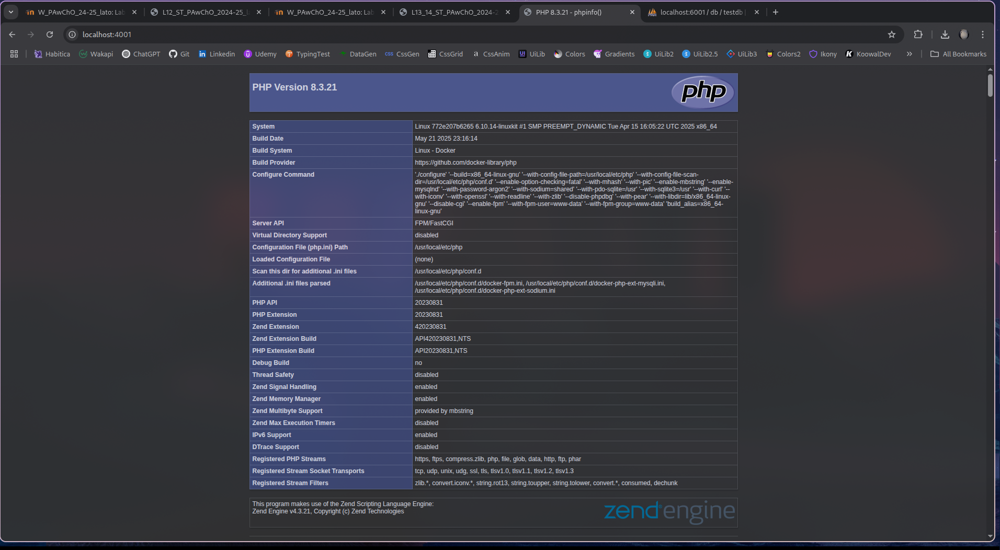
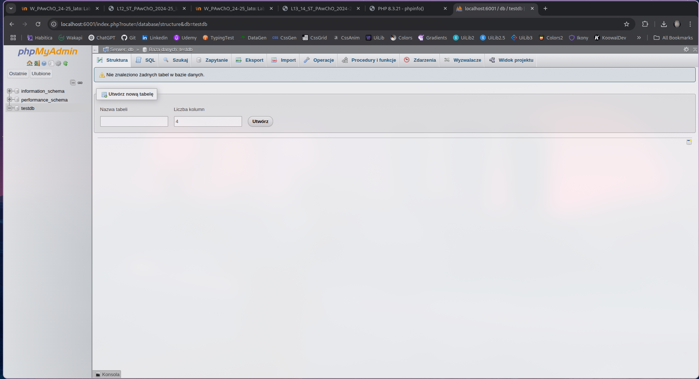
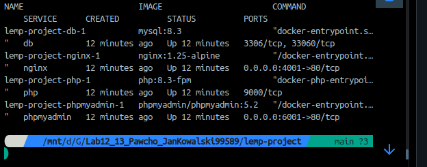

# Stack LEMP + phpMyAdmin — Laboratorium 12–14 (PAwChO)

## 📋 Opis projektu

Celem zadania bylo stworzenie wielokontenerowej aplikacji w oparciu o stack LEMP (Linux, Nginx, MySQL, PHP-FPM) z dodanym interfejsem phpMyAdmin, przy wykorzystaniu `docker-compose`, plików `secrets` oraz podziału konfiguracji na bazową i `override`.

---

## ⚙️ Wykonane kroki

1. Utworzono strukturę projektu:

   ```
   lemp-project/
   ├── docker-compose.yml
   ├── docker-compose.override.yml
   ├── php/Dockerfile
   ├── nginx/default.conf
   ├── www/index.php
   └── secrets/
       ├── db_root_password.txt
       └── db_password.txt
   ```

2. Stworzono plik `docker-compose.yml` definiujący podstawowe obrazy i sieci.

3. W `override` przypisano porty, wolumeny, plik `build`, oraz użycie `secrets`.

4. Uruchomiono aplikację:

   ```bash
   docker compose up -d --build
   ```

5. Przetestowano działanie usług Nginx, PHP-FPM, MySQL, phpMyAdmin oraz połączenie PHP ↔ MySQL.

---

## 🧱 Wykorzystywane usługi

| Nazwa kontenera           | Obraz                       | Status | Porty               |
| ------------------------- | --------------------------- | ------ | ------------------- |
| lemp-project-db-1         | `mysql:8.3`                 | Up     | 3306/tcp, 33060/tcp |
| lemp-project-nginx-1      | `nginx:1.25-alpine`         | Up     | 0.0.0.0:4001→80/tcp |
| lemp-project-php-1        | `php:8.3-fpm`               | Up     | 9000/tcp            |
| lemp-project-phpmyadmin-1 | `phpmyadmin/phpmyadmin:5.2` | Up     | 0.0.0.0:6001→80/tcp |

---

## 📄 Zawartość najważniejszych plików

### `index.php`

```php
<?php
$mysqli = new mysqli("db", "user", "pass", "testdb");
phpinfo();
?>
```

### `Dockerfile` (dla PHP)

```Dockerfile
FROM php:8.3-fpm
RUN docker-php-ext-install mysqli
```

### `default.conf` (dla Nginx)

```nginx
server {
    listen 80;
    root /var/www/html;
    index index.php index.html;

    location ~ \.php$ {
        include fastcgi_params;
        fastcgi_pass php:9000;
        fastcgi_param SCRIPT_FILENAME /var/www/html$fastcgi_script_name;
    }
}
```

### `docker-compose.yml.conf` (dla Nginx)

```
version: "3.8"

services:
  nginx:
    image: nginx:1.25-alpine
    networks:
      - backend
      - frontend

  php:
    image: php:8.3-fpm
    networks:
      - backend

  db:
    image: mysql:8.3
    networks:
      - backend

  phpmyadmin:
    image: phpmyadmin/phpmyadmin:5.2
    networks:
      - backend
      - frontend

networks:
  backend:
  frontend:

```


### `docker-compose.yml.conf` (dla Nginx)

```
version: "3.8"

services:
  nginx:
    ports:
      - "4001:80"
    volumes:
      - ./www:/var/www/html
      - ./nginx/default.conf:/etc/nginx/conf.d/default.conf
    depends_on:
    - db


  php:
    build: ./php
    volumes:
      - ./www:/var/www/html
    depends_on:
    - db


  db:
    environment: 
      MYSQL_DATABASE: testdb
      MYSQL_USER: user
      MYSQL_ROOT_PASSWORD_FILE: /run/secrets/db_root_password
      MYSQL_PASSWORD_FILE: /run/secrets/db_password
    secrets:
      - db_root_password
      - db_password

  phpmyadmin:
    ports:
      - "6001:80"
    environment:
      PMA_HOST: db
    networks:
      - frontend
      - backend

networks:
  backend:
  frontend:

secrets:
  db_root_password:
    file: ./secrets/db_root_password.txt
  db_password:
    file: ./secrets/db_password.txt

```
---

## 🔐 `secrets`

Zamiast jawnych zmiennych środowiskowych, dane dostępowe są przekazane przez:

* `secrets/db_root_password.txt`: `rootpass`
* `secrets/db_password.txt`: `pass`

---

## 🧪 Testy i dowody działania

✅ Po wejściu na `http://localhost:4001`, przeglądarka wyświetla:



✅ Połączenie z bazą zostało poprawnie zainicjalizowane:

```log
[Entrypoint]: Creating database testdb
[Entrypoint]: Creating user user
[Entrypoint]: Giving user user access to schema testdb
```

✅ PhpMyAdmin dostępny na `http://localhost:6001` — możliwe logowanie jako `user` / `pass`, baza `testdb` widoczna.


✅ Stack LEMP:


---

## 📆 Wnioski

* Stack LEMP działa poprawnie i wyświetla domyślną stronę `index.php`
* Połączenie PHP ↔ MySQL działa
* Baza `testdb` została automatycznie zainicjalizowana
* Użycie `secrets` zapewnia bezpieczne przekazywanie haseł
* Konfiguracja została podzielona na plik bazowy i override, zgodnie z wymaganiami CI/CD i best practices Docker Compose
